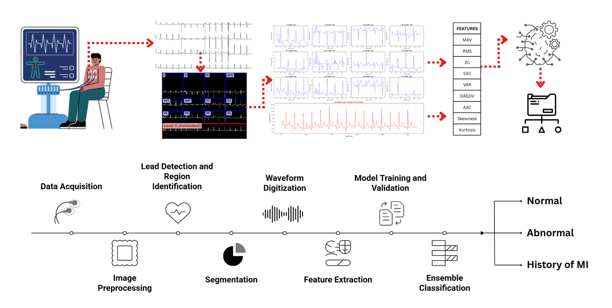

# ECG-INTEX: ECG Image Digitization & Heartbeat Classification

<p align="center">
  
</p>

An end-to-end ECG image digitization and classification framework for detecting cardiac conditions from 12-lead ECG recordings and extended Lead II rhythm signals.

This project processes ECG data, extracts discriminative time-domain features, and applies machine learning models with ensemble learning to classify heart conditions into:

- **Normal Person**
- **Abnormal Heartbeat**
- **History of Myocardial Infarction (MI)**

It is designed as a research-oriented, portfolio-ready project demonstrating the complete pipeline from signal processing to model evaluation.

---

## Problem Statement

Electrocardiograms (ECGs) are widely used to assess cardiac health, but interpreting multi-lead ECG recordings manually can be time-consuming and error-prone.

This project aims to:

- Digitize and process ECG recordings
- Extract meaningful statistical features
- Train and evaluate classification models
- Distinguish between Normal, Abnormal, and MI conditions

The final outputs include structured feature summaries and classification results suitable for machine learning experimentation and academic research.

---

## System Architecture

The framework consists of the following stages:

1. Data acquisition (12-lead ECG + extended Lead II)
2. Signal preprocessing
3. Segmentation
4. Waveform digitization
5. Feature extraction
6. Model training and validation
n+7. Ensemble classification

### Extracted Time-Domain Features

- Mean Absolute Value (MAV)
- Root Mean Square (RMS)
- Zero Crossings (ZC)
- Slope Sign Changes (SSC)
- Variance (VAR)
- DASDV
- Average Amplitude Change (AAC)
- Skewness
- Kurtosis

---

## Model Training & Evaluation

### Models Used

- Support Vector Machines (SVM)
- Random Forest
- XGBoost
- LightGBM
- CatBoost
- Deep Neural Network (DNN)

### Evaluation Strategy

- Stratified 10-fold cross-validation
- Metrics: Accuracy, Precision, Recall, F1-score

### Results

| Dataset Type    | Accuracy                      |
|-----------------|-------------------------------|
| 12-Lead ECG     | **95.7%** (Voting Ensemble)   |
| Rhythm Lead II  | **87.3%**                     |

Key observations:

- Ensemble models outperformed individual classifiers.
- Gradient boosting algorithms showed strong stability.
- Multi-lead ECG features provided higher discriminative power than single-lead rhythm data.

---

## Repository Structure

```text
├── code.ipynb
├── final_check_output/
│   ├── FINAL_COMBINED_SUMMARY.csv
│   ├── summary_12_leads_complete.csv
│   └── summary_extended_lead_II_complete.csv
├── images/
│   └── pipeline.png
├── paper/
│   └── ECG-INTEX.pdf
├── requirements.txt
├── .gitignore
└── README.md
```

### Notes

- The `ECG Dataset/` directory is not included in the repository.
- Large raw ECG files and intermediate artifacts are excluded using `.gitignore`.
- Only lightweight outputs and final summaries are tracked.

---

## Setup

### 1. Clone the Repository

```bash
git clone https://github.com/DhavalPanchal252/ecg-analysis-project.git
cd ecg-analysis-project
```

### 2. Create Virtual Environment (Recommended)

```bash
python -m venv .venv
source .venv/bin/activate   # Linux/macOS
.venv\\Scripts\\activate      # Windows PowerShell
```

### 3. Install Dependencies

```bash
pip install -r requirements.txt
```

### 4. Add ECG Dataset (Not Included)

Place your dataset locally under:

```text
ECG Dataset/
    ├── Abnormal heartbeat/
    ├── History of MI/
    └── Normal Person/
```

---

## Usage

1. Open `code.ipynb` in Jupyter Notebook or VS Code.
2. Ensure the `ECG Dataset/` folder exists locally with the required subfolders.
3. Run the notebook sequentially to:
   - Load ECG data
   - Extract features
   - Generate summary CSV files
   - Train and evaluate classification models

---

## Research Documentation

This project is supported by a detailed technical report available in:

- `paper/ECG-INTEX.pdf`

The report describes the methodology, feature extraction process, and experimental evaluation in depth.

---

## Possible Extensions

- Implement deep learning models (1D-CNN / 2D-CNN).
- Deploy a Streamlit app for live ECG classification.
- Add feature importance and model explainability (e.g., SHAP).
- Convert the pipeline into a modular Python package.

---

## Author

**Dhaval Panchal**  
M.Tech – Software Systems  
Dhirubhai Ambani University
